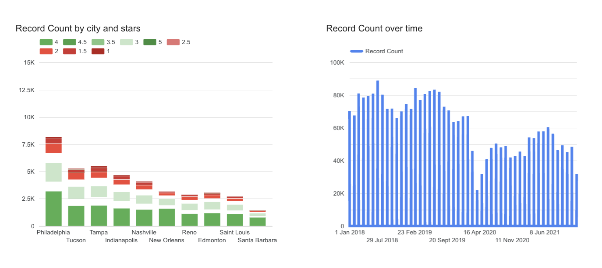

# Yelp Data Pipeline & Analytics Dashboard

## Problem Statement

Yelp offers valuable insights into local businesses, but the raw data provided is in JSON format and requires significant processing before it can be used for analytical purposes. This project aims to automate the data pipeline from ingestion to transformation and visualization, enabling effective business insights on customer reviews, business performance, and user behavior.

It will be a batch processing pipeline that can be scheduled and run end to end.

## Dataset

This project uses the [Yelp Open Dataset](https://business.yelp.com/data/resources/open-dataset/) which provides data on businesses, reviews, and user activity across various regions.

See the [Yelp Dataset Documentation](Yelp_Dataset_Documentation.pdf) for detailed information on each field and table structure.

## Tech Stack

- **Cloud Provider:** Google Cloud Platform (GCP)
- **Data Lake:** GCS (Google Cloud Storage)
- **Data Warehouse:** BigQuery
- **Orchestration:** Apache Airflow (via Docker)
- **Transformation:** dbt (Data Build Tool)
- **Visualization:** Looker Studio
- **IaC:** Terraform

## How It Works

1. **Ingestion:** JSON files are extracted from Yelp ZIP archive and uploaded to GCS.
2. **Staging:** Files are loaded into BigQuery using Airflow DAGs.
3. **Transformation:** dbt models convert raw data into well-structured staging, dimension, and fact tables.
4. **Partitioning:** Fact tables are partitioned by month for optimization.
5. **Visualization:** Looker Studio dashboards are created on top of fact and dimension tables.


## Dashboard
I am using Looker Studio for dashboard creation as it is easy to use and visualize the data. However, I would recommand using more professional data visualization tool such as PowerBI. It is because Looker Studio do not support creating relationship between table, which is a big disadvantage for star/snowflake schema data warehouse structure. 

Here are my two charts:
- Record Count by city and stars: the top 10 cities that has the most yelp review and the review star given (distinguished by color)
- Record Count over time: in three years period, the trend of yelp review record count by month



Dashboard can be view [here](https://lookerstudio.google.com/s/krFjL8HUM14)


## How to Run This Project

### Prerequisites

- [GCP Account](https://console.cloud.google.com/)
- [Terraform](https://developer.hashicorp.com/terraform/downloads)
- [Docker](https://docs.docker.com/get-docker/)
- [Python 3.8+](https://www.python.org/)
- [dbt CLI](https://docs.getdbt.com/dbt-cli/installation)

---

### 1. Clone the Repository

```bash
git clone https://github.com/venusieong/yelp-data-pipeline.git
cd yelp-data-pipeline
```

### 2. Configure Google Cloud
Set up your GCP credentials (use your own service account JSON key):

```bash
export GOOGLE_APPLICATION_CREDENTIALS=~/path/to/terraform-service-account.json
```

### 3. Provision Infrastructure with Terraform
```bash
cd terraform
terraform init
terraform apply
```
This sets up: GCS Bucket, BigQuery Dataset, Service Account

### 4. Launch Airflow with Docker
```bash
cd airflow
docker-compose up --build
```
Once running, access Airflow at: http://localhost:8080
Run the below dag and trigger them in order:
- yelp_extract_to_gcs
- yelp_business_json_to_bq_pipeline
- yelp_gcs_to_bigquery
This will extract & clean JSON from the Yelp zip, then upload raw data to GCS, afterthat load into BigQuery

### 5.Run dbt Transformations
This will generate staging, dimension, and fact tables in BigQuery.
```bash
cd yelp_dbt
dbt run
```

### 6.Visualize in Looker Studio
Connect your BigQuery project to Looker Studio and build dashboards using the fact and dimension tables.

