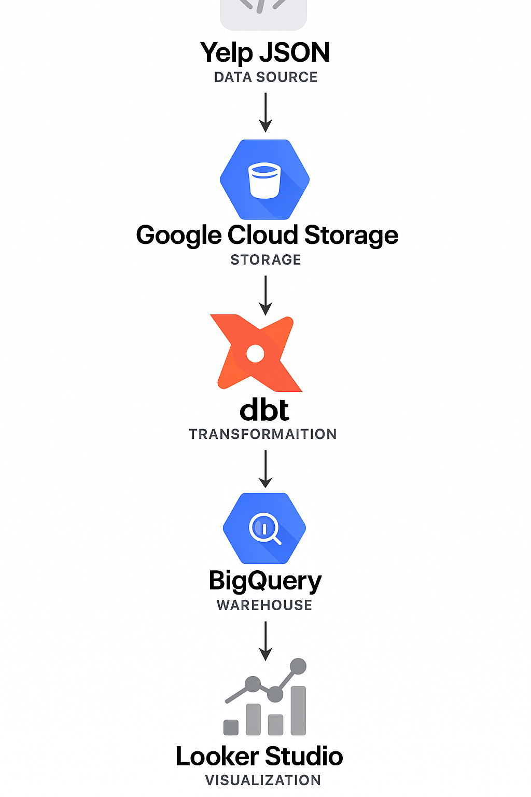

# Yelp Data Pipeline & Analytics Dashboard

## Problem Statement

Yelp offers valuable insights into local businesses, but the raw data provided is in JSON format and requires significant processing before it can be used for analytical purposes. This project aims to automate the data pipeline from ingestion to transformation and visualization, enabling effective business insights on customer reviews, business performance, and user behavior.

## Tech Stack

- **Cloud Provider:** Google Cloud Platform (GCP)
- **Data Lake:** GCS (Google Cloud Storage)
- **Data Warehouse:** BigQuery
- **Orchestration:** Apache Airflow (via Docker)
- **Transformation:** dbt (Data Build Tool)
- **Visualization:** Looker Studio
- **IaC:** Terraform

## How It Works

1. **Ingestion:** JSON files are extracted from Yelp ZIP archive and uploaded to GCS.
2. **Staging:** Files are loaded into BigQuery using Airflow DAGs.
3. **Transformation:** dbt models convert raw data into well-structured staging, dimension, and fact tables.
4. **Partitioning:** Fact tables are partitioned by month for optimization.
5. **Visualization:** Looker Studio dashboards are created on top of fact and dimension tables.

